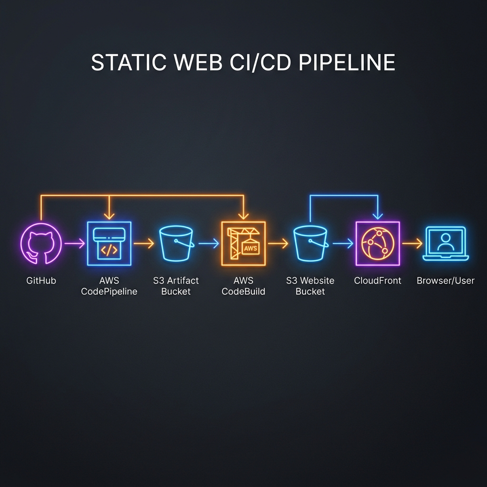

# AWS Static Web Practice

---

## 🚀 Overview
A simple static web project created for practicing AWS services. This repository is intended as a hands-on exercise environment to explore, test, and learn AWS fundamentals while working with static web content.

*AWS Static Web CI/CD Architecture - aws-s3-cloudfront-cicd-site*

## 🛠️ Tech Stack
- **HTML5**: Semantic structure.
- **Vanilla CSS3**: Modern design with glassmorphism and custom color palettes.
- **Google Fonts**: Outfit for high-end typography.

---
*Created for hands-on cloud architecture exploration.*
